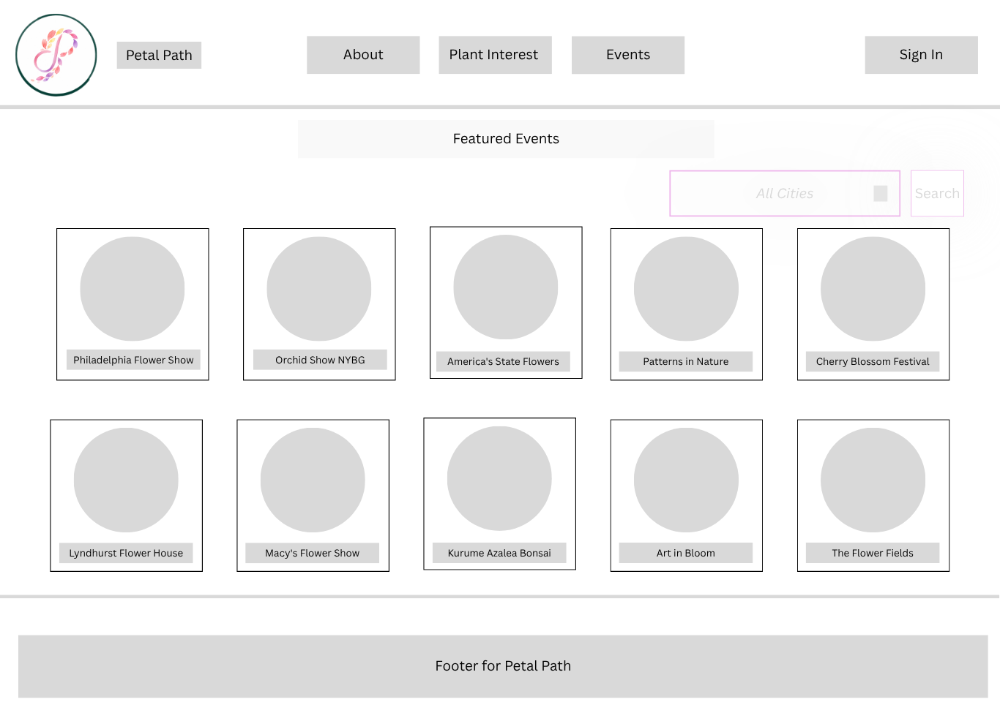
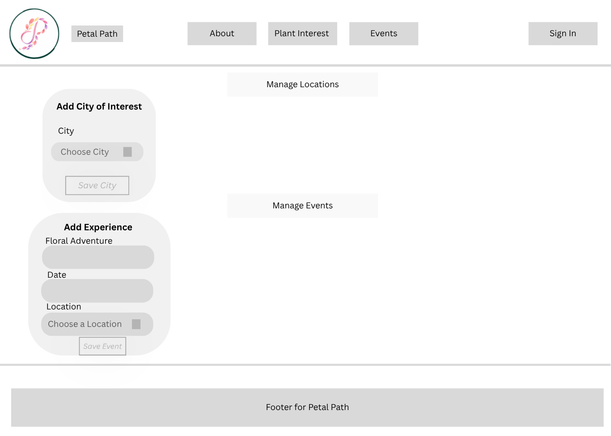
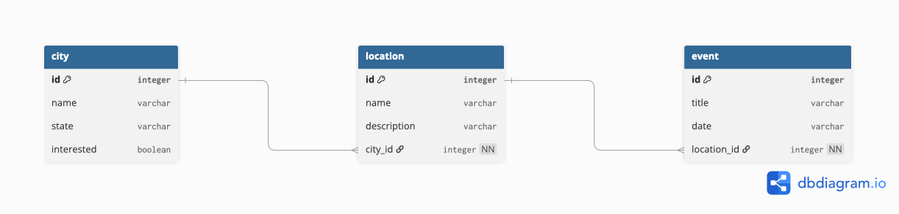

Welcome to Petal Path, a floral discovery app that helps you find your next floral adventure. Add the cities you're interested in. Browse and discover the options around that area, and plan out the floral experiences you want to have! Whether you're chasing seasonal blossoms in New York, experiencing the annual flower show in Philadelphia, or the flower fields in California, we have got you covered coast to coast.

List of Technologies used:

    Languages:
        • JavaScript
        • HTML
        • CSS
        • SQL
        • Java

    Front End:
        • React
        • Vite

    Backend:
        • Spring Boot
        • MySQL

    Development Tools & Environments:
        • IDEs: IntelliJ IDEA, Visual Studio Code
        • Database Management: MySQL Workbench
        • API : Postman

    Version Control: Git/Gibhub

Installation

Prerequisites: Install Node.js, Java, and MySQL locally.

Set up:
    - Navigate to where you want the project through the terminal
    - Clone the repository to your local machine
        • git clone https://github.com/SSINGH264/petal-path-fullstack.git

Backend setup:
    - Navigate to backend/petalback
    - Create a MySQL schema named petalpath
    - Navigate to src/main/resources/application.properties and add your local MySQL username and password
    - Run PetalbackApplication.java to start the backend (URL: http://localhost:8080)
    - In MySQL Workbench, run src/main/resources/seed.sql to load sample cities and locations

Frontend setup:
    - Navigate to frontend/petalfront
    - Install dependencies:
        • In your terminal, run:
            npm install
    - Start the dev server:
        • In your terminal, run:
            npm run dev
    - Press "o" to open the app, or visit http://localhost:5173

Wireframes: 

• Home Page

• Events Page 

•E R Diagram

